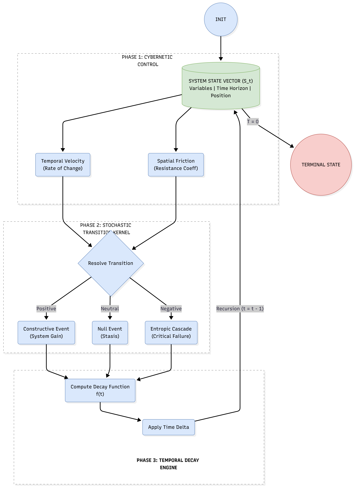

# FLUX: Cybernetic Entropic Simulation Engine


> **"Standard models predict the destination. FLUX simulates the journey."**

---

## 1. Abstract
**FLUX** is a general-purpose **Cybernetic Entropic Simulation Engine** designed to solve the "Entropy Gap" inherent in linear predictive modeling. 

Traditional regression models assume systems are static and linear. They fail to account for **Path Dependency**, **Hysteresis**, and **Feedback Loops**. FLUX replaces these static snapshots with a **Recursive State Machine** that simulates the friction, decay, and chaos of complex systems in real-time.

Whether applied to **High-Frequency Trading (Liquidity Cascades)**, **Supply Chain Logistics (The Bullwhip Effect)**, or **Competitive Game Theory**, FLUX identifies the "Tail Risks" that statistical averages miss.
---

## 2. System Architecture

FLUX operates as a **Closed-Loop Reactor**. It does not output a single prediction; it generates a probability surface based on thousands of recursive Monte Carlo lifecycles.



### The Three Phases of Flux

#### **Phase 1: Cybernetic Control (The Modifier)**
Before an event occurs, the system assesses the **State Vector ($S_t$)** to determine environmental resistance.
*   **Temporal Velocity ($\Delta v$):** The rate of change or "Urgency" of the agent. (e.g., Panic selling, Rush orders, Hurry-up offense).
*   **Spatial Friction ($\mu$):** The resistance of the current position. (e.g., Market illiquidity, Port congestion, Field position).

#### **Phase 2: Stochastic Transition Kernel (The Physics)**
The engine resolves the event based on the modified probabilities.
*   **Constructive Event (+):** System Gain (Profit, Delivery, Score).
*   **Null Event (0):** Stasis (Hold, Delay, Punt).
*   **Entropic Cascade (-):** Critical Failure (Margin Call, Stockout, Turnover). *Note: This triggers a negative feedback loop.*

#### **Phase 3: Temporal Decay Engine (Chronos)**
Time is treated as a finite resource that decays non-linearly based on the event type.
*   $T_{t+1} = T_t - f(\text{Event}, \text{Velocity})$

---

## 3. Universal Applications

FLUX is source-agnostic. The math remains constant; only the variables change.

| Domain | **System State ($S_t$)** | **Friction ($\mu$)** | **Entropic Cascade** | **Alpha Generated** |
| :--- | :--- | :--- | :--- | :--- |
| **Finance** | Market Liquidity | Bid-Ask Spread | Margin Call Spiral | Tail Risk / Crash Prediction |
| **Logistics** | Inventory Levels | Port Congestion | Stockout / Line Stop | Bottleneck Identification |
| **Cybersecurity** | Network Integrity | Firewall Depth | Data Exfiltration | Kill Chain Vulnerability |
| **Game Theory** | Score & Time | Field Position | Turnover / Error | Live Probability / Totals |

---

## 4. Logic Pseudocode

The core logic follows a recursive step function:

```python
def flux_recursive_step(state):
    # 1. CYBERNETICS
    urgency = calculate_velocity(state.time_horizon, state.delta)
    friction = calculate_resistance(state.position)

    # 2. PHYSICS
    outcome = stochastic_transition(state.efficiency, friction, urgency)

    # 3. CHRONOS
    time_decay = compute_chronos_cost(outcome, urgency)
    
    # 4. RECURSION
    new_state = update_vector(state, outcome)
    new_state.time -= time_decay
    
    if new_state.time > 0:
        return flux_recursive_step(new_state)
    else:
        return new_state.terminal_value
5. Documentation & Citation
For a detailed analysis of the mathematical principles behind FLUX, please refer to the White Paper located in this repository:
* 📄 [Beyond Regression: Simulating the Flux of State-Dependent Systems](BEYOND_REGRESSION.md)
Installation
